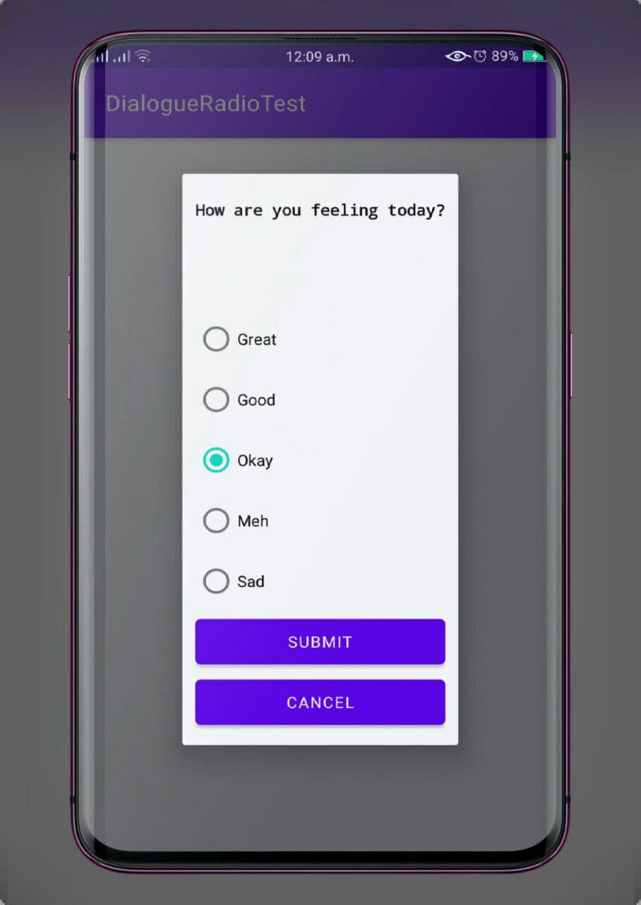

# DialogueRadioTest
#### September 2nd 2021
#### By **Stephen Njeri**



## Description

```bash
The app comprises a simple UI where we utilize one of the most common fragments, a DialogFragment

```
## Technologies Used

* Android studio
* Java
* Junit


## Installation

*git clone
* `git remote add origin https://github.com/Steve-njeri/DialogueRadioTest.git`
* `cd DialogueRadioTest`

## Launching the Application

```bash
1.Launch the project in Android Studio

```

